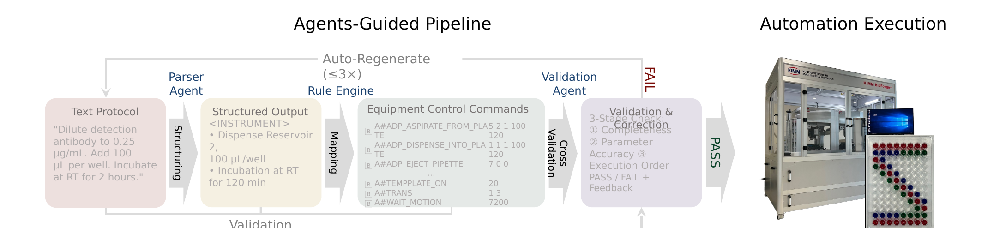

# Dual-Agent Framework for Biological Protocol Translation

> A **Parser Agent + Validation Agent** framework that translates unstructured natural-language
> biological protocols into executable equipment commands, with **3-stage cross-verification**
> and iterative **self-correction** — deployed on the **KIMM BioForge-1** self-driving lab.

🔗 **Project page:** https://hyeonna-choi.github.io/dure-agent/
🎬 **Demo video** · 🖼️ **[Poster (PDF)](docs/poster.pdf)**

> Presented at the **KSME Bio-Engineering Division Spring Conference, 2026** (Poster).



## Overview

Natural-language lab protocols are unstructured and ambiguous, which blocks direct execution on
laboratory hardware. We translate them into machine-executable commands using two cooperating
LLM agents:

1. **Parser Agent** — structures the raw protocol into step-by-step form.
2. **Rule Engine** — maps the structured steps into equipment-control command sequences.
3. **Validation Agent** — cross-verifies on three axes (**completeness, parameter accuracy,
   execution order**) and returns PASS/FAIL with feedback.
4. **Auto-Regenerate (≤3×)** — on FAIL, self-corrects and regenerates before hardware execution.

## Key Findings

- Across **7 parser agents × 3 validation agents**, iterative validation improves translation
  accuracy.
- **Claude Sonnet 4.6** provided the most structured feedback, giving the largest accuracy gains
  through iteration; weaker validators degraded quality over iterations.
- The rule-based (Standard) pipeline outperforms direct LLM command mapping on step completeness,
  parameter accuracy, and step-order accuracy.
- Successfully deployed end-to-end on **KIMM BioForge-1** for automated microplate bioassays.

## Repository structure

```
.
├── docs/                      # GitHub Pages project page
│   ├── index.html
│   ├── poster.pdf
│   └── static/{images,videos,css}
└── README.md
```

## Authors

**Hyeonna Choi**¹, Jung Yup Kim², Hyuneui Lim¹, Seunggyu Jeon¹
¹ Dept. of Bionic Machinery, AI Robot Research Institute, KIMM
² Nano-convergence Manufacturing Research Division, KIMM

## Status

🚧 Conference work (2026). **Source code release pending institutional review.**
